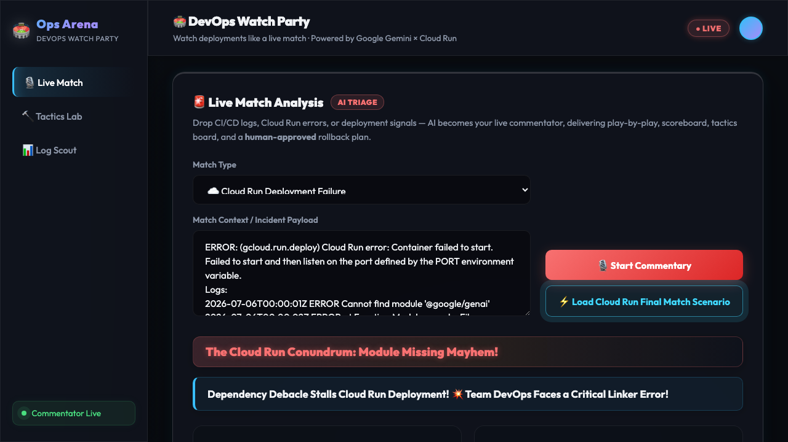

# ProtoPedia 提出文 – Ops Arena / DevOps Watch Party

## 作品名
Ops Arena：DevOpsの障害対応をスポーツ観戦のように体験できるAIエージェント

## タグ
`findy_hackathon`

## 概要（200字以内）
CI/CD、Cloud Run デプロイ、障害対応、ロールバック判断を、スポーツ観戦のように実況・解説するAIエージェント。Google Gemini が「試合実況」「スコアボード」「戦術ボード」「復旧プラン」を生成し、開発者だけでなく非エンジニアにも運用の緊張感と意思決定を届ける。

## コンセプト

DevOpsの障害対応を、スポーツ観戦のように理解できるAIエージェント。CI/CD、Cloud Run、ログ、ロールバック判断をAIが実況・解説し、開発者だけでなく非エンジニアにも運用の緊張感と意思決定を伝える。

## ハッカソンテーマとの対応

| テーマ | Ops Arena の機能 |
|---|---|
| **つくる** | Tactics Lab: Issue 説明 → AI が Terraform/YAML/コード修正を生成 |
| **まわす** | Log Scout: ログ → 異常検知 + 改善提案。Live Match: CI/CD/Cloud Run インシデントを AI が実況 |
| **とどける** | Cloud Run デプロイ済みダッシュボード。デモシナリオボタン1クリックで体験可能 |

## 主要機能

### 🚨 Live Match（メイン機能）
- Cloud Run デプロイ失敗・GitHub Actions エラー・ログ異常を入力
- AIが「試合タイトル」「実況ヘッドライン」「プレイバイプレイ（タイムライン）」を生成
- **スコアボード**：Health Score / Deployment Confidence / Recovery Progress をバー表示
- **転換点**：試合の流れを決めた重要イベントを抽出
- **戦術ボード**：即時・中期・長期の対応策を整理
- **復旧プラン**：ロールバック手順（人間承認前提）を明示

### 🔨 Tactics Lab
- Issue 説明 → Gemini が Terraform/YAML/Bash コード修正を生成

### 📊 Log Scout
- アプリログ → AI が異常を検知して改善アクションを提案

## 使用技術
- **AI**: Google Gemini 2.5 Flash（`@google/genai` SDK）
- **Backend**: Node.js + Express（Cloud Run / Docker）
- **Frontend**: Vite + Vanilla JS（glassmorphism ダークモード UI）
- **CI/CD**: GitHub Actions + Cloud Build + Cloud Run
- **Infrastructure**: Google Cloud Run

## 安全設計
- ロールバック・削除コマンドは **人間の承認前提の推奨手順** としてのみ出力
- エージェントが自律的に本番環境を変更することは **設計上不可能**
- `GEMINI_API_KEY` 未設定時は deterministic fallback で動作（デモ・審査用途に最適）

## デモ URL
https://devops-agent-x-602964828967.asia-northeast1.run.app

## ソースコード
https://github.com/dorakingx/devops-agent-x

## スクリーンショット

## デモ動画
[ops-arena-demo.mp4](demo-assets/ops-arena-demo.mp4)

*(Note: ProtoPediaにアップロードする際は、リポジトリ内の `demo-assets/thumbnail.png` と `demo-assets/ops-arena-demo.mp4` を手動でアップロードして設定してください。)*
